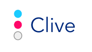
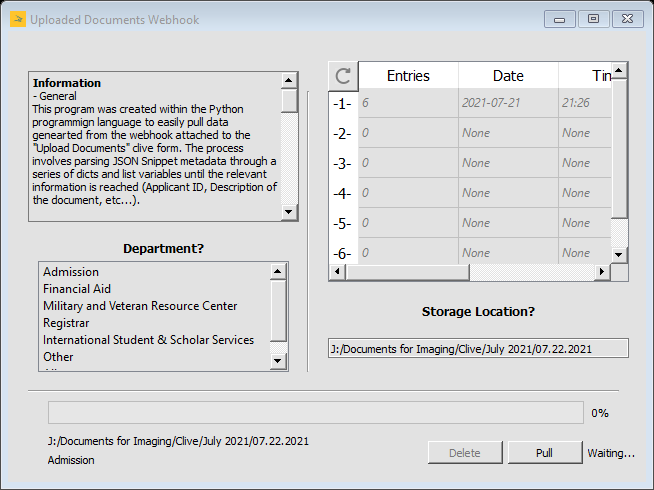

[![LinkedIn][linkedin-shield]][linkedin-url]

<br />
 <p align="center">
  <a href="https://github.com/Nick-Prog/Clive-Webhook">
    
  </a>
   </p>
</p>

# Clive-Wehbook
The main purpose of this program was to utilize a webhook connection on an online form that has a high amount of traffic on a daily basis. 

**If you wish to convert the program into a runnable program for others to easily download then follow the Publish Python Apps link below.**

# About The Project
<br />
 <p align="center">
  <a href="https://github.com/Nick-Prog/Clive-Webhook">
    
  </a>
   </p>
</p>

* The box located on the **top left** provides general information for the user if they wish to understand the purpose of the program, as well as, how to use its most basic features.

* The box located on the **bottom left** titled **Department?** provides 7 different options for the user to pick. Each option was made according to the Clive form you can find at the TAMUK Upload Forms link below.

* The box located on the **top right** contains real time information for the user if they wish to know what each departments current amount of entries available for pulling, the date and time they were last submitted, and the last date the system had checked for updates.

**Disclaimer: The user must relaunch the program to receive up-to-date information on the table discussed above.**

* Finally, the box located on the **bottom right** titled **Storage Location?** indicates the storage location the user wishes to download their pulled documents to.

All user inputs can be viewed on the labels below the progress bar before pulling. Once pulled, the delete button will become active allowing the user to remove the pulled documents from the pipedream webhook website. As of right now, this program can only pull and delete 100 documents at a time.

# Getting Started
Follow the instruction below to successfully run the program.

## Prerequisities
A Python 3.9 environment was used to create and run this program, but anything up to 3.6 should suffice. Since this program mainly uses Pipedream as a hosting source, a Pipedream account will be needed to genereate your webhook link. 

## Requirements
 1. Clone/download the repo
    ```sh
    git clone https://github.com/your_username/Project-Name.git
    ```
 2. Now that you have the files on your machine, replace all <webhook> and <api_key> values within the connection.py file. Your <api_key> can be found in the settings of your     account with Pipedream, without it you will be  unable to interact with the webhook link so keep it SAFE.
 3. Finally, execute the main.py file and your program  should run after a short period.
 
 **Disclaimer: This program was made SPECIFICALLY for this exact problem. Unless the JSON Snippet metadata genearted for your problem is exactly the same, you must alter most if not all of the code.**
  
 <br />
  <p align="center">
  <a href="https://github.com/Nick-Prog/Clive-Webhook">
    
  </a>
  </p>
</p>
 
# Change Log
 **Version 1.1**
 * Added a "Refresh" push button to the **top left** of the real time information table.
 * Improved load times and added a sleep thread to prevent multiple miss-inputs.
 * Included an autmoated storage location setter for the TAMUK purposes.
 * Fixed problems with the real time information table (i.e. Date, Time, and Last weren't updating properly)
 * Removed the disable feature from the other options under Department and added their funcitonality.
 * Delete button now only removes the entries pulled at that time.
 * Added extra labels to the right of the "Pull" push button to better display the current state of the program.
 * Added a mininize feature and fixed window sizes.
 * Added images to the Dialog box and the "Refresh" button.
 
 ## Reported Bugs
 All reported bugs may be caused from similar instead of seperate instances.
 * When downloading to a large share drive, potential temporary freezing may occur.
 * Delete request very rarely skip items that have been just pulled.
  
# Contact
Nickolas Rodriguez | Twitter: @_Nick_Rod_ | Email: Nickolasrodriguez98@gmail.com | GitHub: Nick-prog

# Acknowledgements
* [Pipedream](https://www.pipedream.com/)
* [TAMUK Upload Forms](https://www.tamuk.edu/enrollment-management/admission/future-students/ftic-transfer/uploaddocs.html)
* [Publish Python Apps](https://gist.github.com/ForgottenUmbrella/ce6ecd8983e76f6d8ef47e07240eb4ac)
 
<!--MARKDOWN LINKS & IMAGES -->
 [linkedin-shield]: https://img.shields.io/badge/-LinkedIn-black.svg?style=for-the-badge&logo=linkedin&colorB=555
 [linkedin-url]: https://linkedin.com/in/nickolas-rodriguez-392498197/
